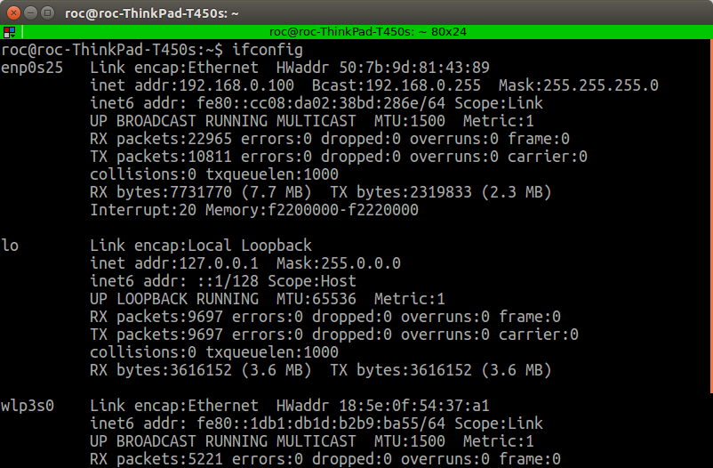
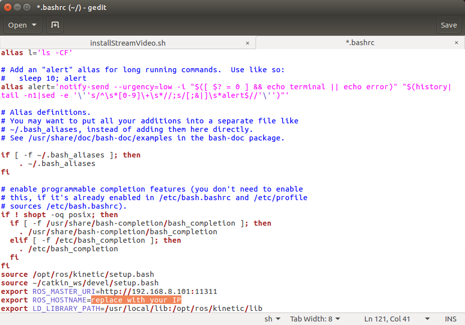

# Xbot2机器人用户电脑安装

### 获取github一键安装包

在安装好Ubuntu16.04的电脑中使用菜单打开Terminal窗口或者键盘同时按下control+alt+t按键，打开命令行：


在命令行中输入指令：

```bash
git clone https://github.com/yowlings/installPC.git
```


### 运行一键安装指令：

进入文件夹installPC

```bash
./installPC_x64.sh
```


运行后需要输入一次电脑的密码。

然后可能需要几分钟的安装时间，耐心等待运行完毕

### 连接机器人网络

使用电脑的无线网络连接到机器人的网络系统。

> 网络名称：xbot
>
> 无线网络密码：xbot1234

###查看本机IP地址

成功连接网络之后，继续在命令行中输入

```bash
ifconfig
```

然后可以看到



屏幕上的无线网络项目下的192.168.8.*的地址即是你的电脑IP地址，记下这个IP。

### 修改.bashrc文件

继续在命令行输入

```bash
gedit ~/.bashrc
```

然后找到倒数第二行，将该行的**replace with your IP**改成你刚才记下的IP地址，保存即可。



修改完成后运行指令：

```bash
source ~/.bashrc
```

至此，PC端的安装即已完成，放心地开始使用吧^_^