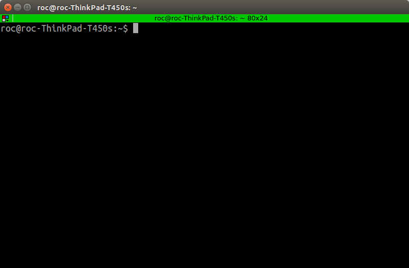
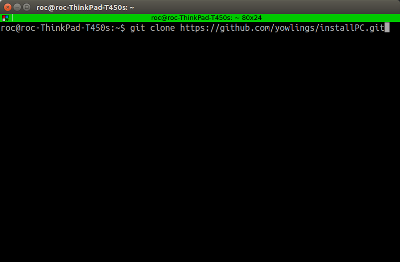
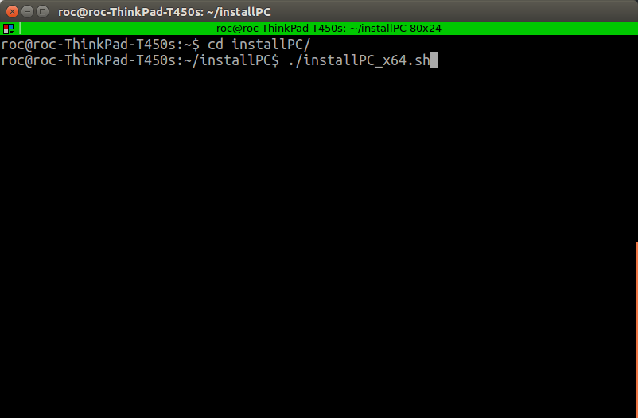

# Xbot2机器人用户电脑安装

### 获取github一键安装包

在安装好Ubuntu16.04的电脑中使用菜单打开Terminal窗口或者键盘同时按下control+alt+t按键，打开命令行：



在命令行中输入指令：

```bash
git clone https://github.com/yowlings/installPC.git
```



完成后进入文件夹installPC，运行一键安装指令：

```bash
./installPC_x64.sh
```



等待完成即可。